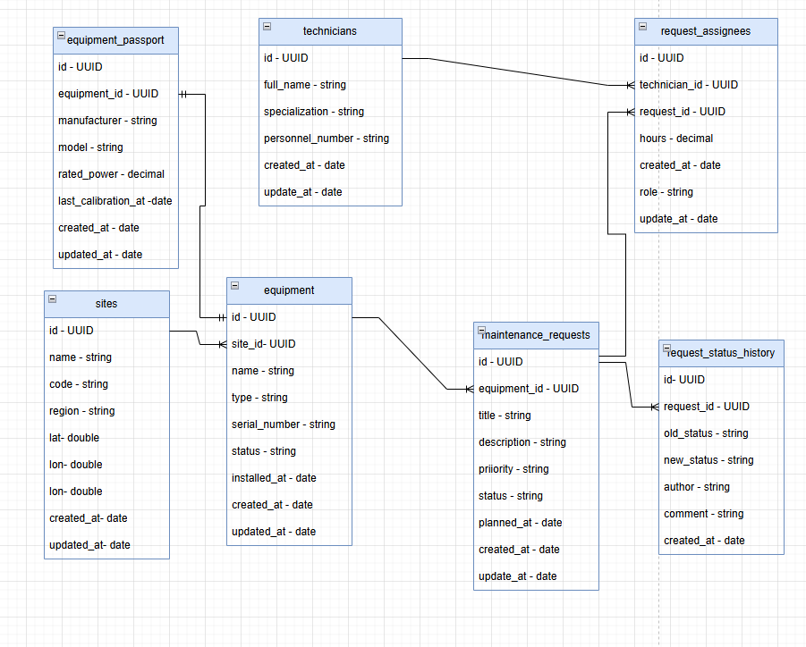

# weather-maintenance-api

REST API для планирования технического обслуживания оборудования с учётом погодных условий.
Погодные данные берутся из бесплатного сервиса [Open-Meteo](https://open-meteo.com) (без API-ключа): прогноз температуры, осадков и ветра позволяет определить дни, подходящие для работ на открытом воздухе.

## Описание сервиса

- Реестр оборудования: установки турбин, инверторов, датчиков и подстанций с геолокацией и серийными номерами.
- Заявки на обслуживание: создание, редактирование, жизненный цикл статусов.
- Погодное API: прогноз на 3 дня в точке установки оборудования с признаком пригодности для наружных работ (`suitableForOutdoorWork`).
- Роли и аутентификация: JWT access-токен + refresh-cookie, три роли (`viewer`, `technician`, `admin`) с разными правами.
- Мониторинг: метрики Prometheus на `GET /metrics`, Prometheus + Alertmanager + Grafana в `docker compose` с автоматическим provisioning.
- Эксплуатационные endpoints: `GET /api/health/live`, `GET /api/health/ready`, `GET /api/docs` (Swagger UI).
- Данные хранятся в PostgreSQL: репозитории скрывают SQL, бизнес-логика и HTTP-слой не зависят от БД.
- Структурные JSON-логи (pino) с единым `requestId` через `AsyncLocalStorage`.

> Данные не теряются при перезапуске сервера: они лежат в PostgreSQL, а схема и демонстрационные наполнения создаются миграциями и сидами (`sync({ force: true })` в проекте не используется).

## Требования к окружению

- Node.js >= 20.0.0
- PostgreSQL >= 14 (локальный запуск: создайте базу `maintenance` и пользователя из `.env`; в Docker базу создаёт сам сервис `db`)
- Доступ к `api.open-meteo.com` и `geocoding-api.open-meteo.com` (для погодных эндпоинтов)

## Установка и запуск

### Локально

```bash
npm install
cp .env.example .env   # при необходимости правьте DB_* под свой PostgreSQL
npx sequelize-cli db:migrate   # схема + перенос данных Кейса 2 из коллекции
npx sequelize-cli db:seed:all   # демонстрационные данные
npm run dev            # режим разработки (auto-restart, pretty-логи)
npm start              # продакшен-запуск (JSON-логи)
```

Сервер по умолчанию поднимается на `http://localhost:3000`. Проверка: `GET /api/health`.

### Развёртывание с нуля (Docker)
Вначале необходимо создать SSL сертификат. Я его создавала для ЛОКАЛЬНОЙ виртуальной машины следующими командами (192.168.1.10 - ip сервера):
```bash
# 1. Создание сертификата для  127.0.0.1 и 192.168.1.10
mkcert -cert-file fullchain.pem -key-file privkey.pem localhost 127.0.0.1 ::1 192.168.1.10
# 2. Создать папку
mkdir ./deploy/nginx/certs
# 3. Скопировать сертификат в эту папку
 scp fullchain.pem privkey.pem sveta@192.168.1.10:~/ver_1/weather-maintenance/deploy/nginx/certs/
```
Порядок: поднять PostgreSQL → дождаться healthcheck → применить миграции →
наполнить сидами → запустить приложение. `docker compose up -d --build` поднимает
и БД, и API (API ждёт `service_healthy` у БД), а также весь стек мониторинга
(Prometheus, Alertmanager, Grafana) с provisioning из репозитория, но миграции и
сиды выполняются отдельно — в образе только production-зависимости, а
`sequelize-cli` нужен из `devDependencies`.

```bash
cp .env.example .env
# 1. поднять контейнеры (БД — именованный том pgdata, API ждёт healthcheck БД)
docker compose up -d --build

# 2. убедиться, что PostgreSQL healthy
docker compose ps

# 3. применить миграции: создают схему и переносят данные Кейса 2
docker compose exec api npx sequelize-cli db:migrate

# 4. наполнить демонстрационными данными
docker compose exec api npx sequelize-cli db:seed:all

# 5. перезапустить API, чтобы он подхватил схему
docker compose restart api
```

Шаги 3 и 4 выполняются с хостов с тем же `.env`, что и у compose: `DB_HOST=localhost`
(для контейнера — `db`). Адреса: API на `:3000`, БД на `${DB_PORT}`,
`GET /api/health/ready` возвращает `{"data":{"ready":true}}`.

> `DB_PORT` в `.env` — это порт БД **на хосте**: compose публикует наружу
> `${DB_PORT}:5432`. Если на машине уже работает свой PostgreSQL на 5432, контейнер
> не сможет занять порт, а хостовые `db:migrate`/`db:seed:all` (которые ходят на
> `localhost:${DB_PORT}`) попадут в чужую базу и упадут с ошибкой пароля. В таком
> случае поставьте свободный порт, например `DB_PORT=5434`, и пересоздайте БД:
> `docker compose up -d --force-recreate db`.

Наружу всё публикует только nginx (см. «Обратный прокси»). Порты меняются
переменными `NGINX_PORT`, `PROMETHEUS_PORT`, `ALERTMANAGER_PORT`, `GRAFANA_PORT`:

| Сервис       | Адрес                    | Учётные данные              |
| ------------ | ------------------------ | --------------------------- |
| Приложение через прокси | http://localhost:8080 | —                  |
| API напрямую (только с рабочего компьютера) | http://localhost:3000 | —     |
| Prometheus   | http://localhost:9090    | —                           |
| Grafana      | http://localhost:3001    | `GRAFANA_ADMIN_USER` / `GRAFANA_ADMIN_PASSWORD` (по умолчанию `admin` / `admin`) |
| Alertmanager | http://localhost:9093    | —                           |

Метрики Prometheus (`http://localhost:8080/metrics`) и все три интерфейса
мониторинга отдаются только с разрешённых адресов — список в
`deploy/nginx/conf.d/monitoring-allow.inc` (по умолчанию localhost и приватные
сети). Прямой порт API оставлен на `127.0.0.1`: обратиться к приложению в обход
прокси и подделать `X-Forwarded-For` нельзя.

Дашборд и источник данных в Grafana появляются сами при старте: ручная настройка
после развёртывания не требуется (см. «Мониторинг»).

Откат и повторное применение: `npx sequelize-cli db:migrate:undo` откатывает
последнюю миграцию, `npx sequelize-cli db:migrate:undo:all` — все.

## Миграции и сиды

- Схему создают только миграции из `src/migrations` (`sequelize-cli`);
  `sync({ force: true })` в проекте нет.
- У каждой миграции есть рабочий `down`, полный цикл «применить все → откатить
  все → применить снова» проходит без ошибок.
- `src/migrations/20260927091048-migrate-from-json.cjs` переносит данные Кейса 2
  из `docs/postman/collection.json` (площадки, оборудование, заявки, история
  статусов) в транзакции; откат удаляет именно перенесённые записи.
- `src/migrations/20260927170000-equipment-text-search.cjs` включает `pg_trgm` и
  создаёт GIN-индексы `gin_trgm_ops` по `equipment.name` и `equipment.serial_number`
  для поиска `GET /equipment?search=`. Откат удаляет индексы и снимает расширение,
  если после отката других индексов на `gin_trgm_ops` в схеме не осталось.
- Сиды `src/seeders` дают наполнение, достаточное для демонстрации всех связей и
  обоих отчётов: 2 площадки, 6 единиц оборудования (с паспортами), 5 специалистов,
  20 заявок, распределённых по всем четырём статусам, плюс назначения бригад и
  история переходов статусов. После миграций и сидов в базе получается 3 площадки,
  7 единиц оборудования и 21 заявка — с учётом данных, перенесённых из коллекции.
- `src/seeders/20260927091048-migrate-from-json.cjs` — пустая заглушка из шаблона
  `sequelize-cli` с тем же именем, что и миграция; перенос данных выполняет
  миграция, сид ничего не добавляет.

## Веб-страница управления заявками

Простая страница `public/index.html` раздаётся тем же сервером и открывается в браузере: `http://localhost:3000/`. Она работает с API через `fetch` (тот же origin, CORS не нужен). Страницу также можно открыть как локальный файл (`file://`) — `Origin: null` разрешён CORS-конфигурацией:

- **Вход** — форма логина и кнопка выхода. Access-токен хранится только в памяти
  страницы, поэтому после перезагрузки сессия восстанавливается по refresh-cookie
  через `POST /api/auth/refresh`; если refresh не проходит, открывается форма входа и
  защищённые запросы не выполняются.
- **Список заявок** — таблица с фильтрами по статусу, приоритету и оборудованию, постраничная навигация.
- **Форма создания** — выбор оборудования из `GET /api/equipment`, название, описание, приоритет, планируемая дата; создание через `POST /api/requests`. Форма и кнопки смены статуса показываются только ролям `technician` и `admin`, у `viewer` их нет.
- **Истёкший токен** — при 401 страница один раз продлевает сессию и повторяет запрос; повторная неудача возвращает на форму входа.
- Смены статуса, назначения исполнителей, сводок и отчётов на странице нет — они доступны только через API.
- Ошибки API (422 с деталями, 404, 409, 429) выводятся в блоке сообщений.

## Переменные окружения

| Переменная                | По умолчанию                                     | Описание                                                    |
| ------------------------- | ------------------------------------------------ | ----------------------------------------------------------- |
| `NODE_ENV`                | `development`                                    | Окружение (`production` выключает pino-pretty)              |
| `PORT`                    | `3000`                                           | Порт HTTP-сервера                                           |
| `TRUST_PROXY`             | (выключено; в compose `1`)                       | Доверие обратному прокси: `1` — один хоп (nginx), `loopback`, `true`, `false`. Нужно, чтобы rate limit и логи видели реальный IP клиента |
| `LOG_LEVEL`               | `info`                                           | Уровень логирования pino                                    |
| `CORS_ORIGINS`            | (пусто)                                          | Разрешённые источники CORS (через запятую)                  |
| `RATE_LIMIT_WINDOW_MS`    | `900000` (15 мин)                                | Окно ограничения частоты запросов                           |
| `RATE_LIMIT_MAX`          | `100`                                            | Максимум запросов за окно                                   |
| `WEATHER_API_URL`         | `https://api.open-meteo.com/v1/forecast`         | Базовый URL прогноза Open-Meteo                             |
| `GEOCODING_API_URL`       | `https://geocoding-api.open-meteo.com/v1/search` | URL геокодинга Open-Meteo                                   |
| `REQUEST_TIMEOUT_MS`      | `5000`                                           | Таймаут запроса к погодному API (мс)                        |
| `WIND_THRESHOLD_MS`       | `8`                                              | Порог ветра (м/с) для пригодности наружных работ            |
| `WEATHER_MAX_CONCURRENT`  | `4`                                              | Максимум одновременных запросов к Open-Meteo                |
| `REPORTS_DIR`             | `./reports`                                      | Зарезервировано (пока не используется кодом)                |
| `DB_HOST`                 | `localhost`                                      | Хост PostgreSQL                                             |
| `DB_PORT`                 | `5432`                                           | Порт PostgreSQL                                             |
| `DB_NAME`                 | `maintenance`                                    | Рабочая база                                                |
| `DB_USER` / `DB_PASSWORD` | —                                                | Учётные данные PostgreSQL                                   |
| `DB_POOL_MAX`             | `10`                                             | Максимум соединений в пуле Sequelize                            |
| `TEST_DB_NAME`            | `${DB_NAME}_test`                                | База автотестов (имя обязательно содержать `test`)              |
| `JWT_SECRET`              | — (обязателен в production)                      | Секрет подписи access-токенов                                   |
| `JWT_REFRESH_SECRET`      | значение `JWT_SECRET`                            | Секрет подписи refresh-токенов                                  |
| `JWT_ACCESS_TTL` / `JWT_REFRESH_TTL_MS` | `15m` / `604800000`                   | Время жизни access-токена и refresh-токена                       |
| `BCRYPT_ROUNDS`           | `12`                                             | Стоимость хеширования паролей                                   |
| `REFRESH_COOKIE_NAME`      | `refresh_token`                                  | Имя refresh-cookie                                              |
| `COOKIE_SAME_SITE` / `COOKIE_SECURE` | `lax` / `true` в production          | Атрибуты refresh-cookie                                          |
| `AUTH_RATE_LIMIT_WINDOW_MS` / `AUTH_RATE_LIMIT_MAX` | `900000` / `10`              | Ограничение неудачных попыток входа                              |
| `SEED_ADMIN_PASSWORD`, `SEED_TECH_PASSWORD`, `SEED_VIEWER_PASSWORD` | демо-значения | Пароли демонстрационных пользователей сида        |
| `HEALTH_DB_TIMEOUT_MS`    | `2000`                                           | Таймаут проверки БД в `/api/health/ready` (мс)                   |
| `SHUTDOWN_TIMEOUT_MS`     | `10000`                                          | Предел ожидания при остановке, дальше — принудительный выход    |
| `METRICS_COLLECT_DEFAULT` | `true`                                           | Собирать ли стандартные `process_*`/`nodejs_*` метрики          |
| `METRICS_APPLIED_TOP_N`   | `20`                                             | Сколько площадок и оборудования попадает в прикладные метрики   |
| `METRICS_CACHE_MS`        | `5000`                                           | Кэш результатов агрегатов PostgreSQL на одно окно скрейпа      |
| `DOCS_ENABLED`            | `true`                                           | Включён ли `/api/docs`                                           |
| `DOCS_REQUIRE_AUTH`       | `false`                                          | Требовать access-токен для `/api/docs`                          |
| `PROMETHEUS_PORT`         | `9090`                                           | Порт Prometheus на хосте                                        |
| `ALERTMANAGER_PORT`       | `9093`                                           | Порт Alertmanager на хосте                                      |
| `GRAFANA_PORT`            | `3001`                                           | Порт Grafana на хосте                                           |
| `GRAFANA_ADMIN_USER` / `GRAFANA_ADMIN_PASSWORD` | `admin` / `admin`             | Учётные данные Grafana (пароль стоит сменить)                   |
| `PROMETHEUS_RETENTION`    | `15d`                                            | Хранение истории метрик в Prometheus                            |
| `ALERT_EMAIL_TO` / `ALERT_EMAIL_FROM` | `ops@example.com` / `alerts@example.com` | Адресат оповещения Alertmanager                       |
| `ALERT_SMTP_HOST` / `ALERT_SMTP_PORT` / `ALERT_SMTP_USER` / `ALERT_SMTP_PASSWORD` | `localhost` / `25` / `alerts` / `alerts` | SMTP для отправки оповещений                   |

Параметры подключения (`host`, `port`, `database`, `user`, `password`) читаются
из окружения в `src/config/sequelize.config.cjs` и передаются в `new Sequelize(...)`
в `src/models/sequelize.js`. Профили `development` и `test` заданы явно; при
`NODE_ENV=production` (в Docker) используется профиль `development` с теми же
переменными `DB_*` — отдельной секции `production` в конфиге нет.
`TEST_DB_NAME` читается конфигом, но в `.env.example` отсутствует (нужен только
автотестам). `DB_POOL_MAX` передаётся в пул Sequelize и виден в метриках
`maintenance_db_pool_in_use` / `maintenance_db_pool_max` / `maintenance_db_pool_waiting`.
Все переменные
приложения перечислены в `.env.example`, секретов в репозитории нет: `.env`
не отслеживается, а `JWT_SECRET` в production обязателен.

Compose читает `DB_NAME`, `DB_USER`, `DB_PASSWORD`, `DB_PORT`, `PORT` из того же
`.env` и передаёт их сервису `db`, а сервису `api` — `NODE_ENV`, `DB_*`;
контейнер приложения видит БД по хосту `db`.

## Эндпоинты

Все маршруты доступны после префикса `/api`.

### Health и эксплуатационные endpoints

| Метод | Путь                   | Назначение                                              | Коды ответа |
| ----- | ---------------------- | ------------------------------------------------------- | ----------- |
| GET   | `/api/health/live`     | Жизнеспособность процесса (БД не проверяется)           | 200         |
| GET   | `/api/health/ready`    | Готовность к обслуживанию, включая доступность БД       | 200, 503    |
| GET   | `/api/health`          | Сводное состояние (тот же результат готовности)         | 200, 503    |
| GET   | `/api/health/metrics`  | Прикладные агрегаты из PostgreSQL в JSON                | 200         |
| GET   | `/metrics`             | Метрики приложения для системы мониторинга (Prometheus) | 200         |
| GET   | `/api/docs`            | Интерактивная документация OpenAPI (Swagger UI)         | 200         |
| GET   | `/api/docs/openapi.json` | Спецификация OpenAPI 3.0.3                            | 200         |

Токен для этих эндпоинтов не нужен: они должны работать, когда пользователи
ещё не могут войти в систему.

`/api/health/ready` возвращает 503, если база данных недоступна дольше
`HEALTH_DB_TIMEOUT_MS` или процесс завершает работу:

```json
{ "data": { "ready": false, "status": "not_ready", "checks": { "database": { "status": "error", "error": "timeout 2000ms" } } } }
```

При недоступной БД сервис не падает молча: `docker compose ps api` показывает
контейнер как `unhealthy` (healthcheck вызывает именно `/api/health/ready`),
а Prometheus поднимает алерт `ApiNotReady`.

### Аутентификация и роли

| Метод | Путь                  | Назначение                                | Коды ответа |
| ----- | --------------------- | ----------------------------------------- | ----------- |
| POST  | `/api/auth/register`  | Регистрация пользователя                  | 201, 409, 422 |
| POST  | `/api/auth/login`     | Вход: access-токен + refresh-cookie       | 200, 401, 429 |
| POST  | `/api/auth/refresh`   | Обновление пары токенов по refresh-cookie | 200, 401    |
| POST  | `/api/auth/logout`    | Выход: отзыв refresh-токена               | 204         |
| GET   | `/api/auth/me`        | Текущий пользователь                      | 200, 401    |

Все защищённые endpoints требуют заголовок `Authorization: Bearer <accessToken>`.
Access-токен живёт 15 минут, refresh хранится в HttpOnly-cookie и при
`/api/auth/refresh` ротируется (старый становится недействительным).

| Роль         | Права                                                                                     |
| ------------ | ------------------------------------------------------------------------------------------ |
| `viewer`     | Чтение справочников, заявок, истории и отчётов                                               |
| `technician` | Права `viewer` + создание и редактирование заявок + смена статуса заявок, на которые назначен |
| `admin`      | Все операции: оборудование, назначение бригад, удаление записей, любые статусы               |

`technician` без связи со специалистом (`technicianId` при регистрации) не сможет
менять статус ни одной заявки: 403 `NOT_ASSIGNED`. Роль читается из БД на каждый
запрос, поэтому её понижение действует немедленно.

### Оборудование

| Метод  | Путь                      | Описание                                 | Коды ответа        |
| ------ | ------------------------- | ---------------------------------------- | ------------------ |
| GET    | `/equipment`              | Список с пагинацией и фильтрами          | 200, 400, 422      |
| POST   | `/equipment`              | Создать оборудование                     | 201, 409, 422      |
| GET    | `/equipment/:id`          | Получить оборудование                    | 200, 404           |
| PATCH  | `/equipment/:id`          | Обновить оборудование                    | 200, 404           |
| DELETE | `/equipment/:id`          | Удалить (запрещено с открытыми заявками) | 204, 404, 409      |
| GET    | `/equipment/:id/requests` | Заявки оборудования с пагинацией         | 200, 400, 404, 422 |
| GET    | `/equipment/:id/weather`  | Прогноз погоды в точке оборудования      | 200, 404, 502      |

Параметры `GET /equipment`: `page` (1), `limit` (20, 1–100), `offset` (0–10000), `sortBy`,
`order` (`asc|desc`), `status` (`operational|maintenance|fault|decommissioned`),
`type` (`turbine|inverter|sensor|substation`), `search` (1–100 символов).
Параметры `GET /equipment/:id/requests`: `page`, `limit`, `offset`.
Допустимые `sortBy`: `name`, `type`, `status`, `serialNumber`, `installedAt`, `createdAt`, `updatedAt`.

`search` ищет подстроку без учёта регистра одновременно в `name` и `serialNumber`
(`ILIKE`), в том числе в середине слова. Символы `%`, `_` и `\` из пользовательского
ввода экранируются и трактуются как обычные символы, поэтому `search=%` не превращается
в шаблон «всё подряд». Пустая строка и длиннее 100 символов — `422 VALIDATION_ERROR`.
`search` суммируется с `status`, `type`, `sortBy` и пагинацией.

### Заявки на обслуживание

| Метод  | Путь                              | Описание                             | Коды ответа        |
| ------ | --------------------------------- | ------------------------------------ | ------------------ |
| GET    | `/requests`                       | Список с фильтрами                   | 200, 400, 422      |
| POST   | `/requests`                       | Создать заявку                       | 201, 404, 422      |
| GET    | `/requests/:id`                   | Получить заявку                      | 200, 404           |
| PATCH  | `/requests/:id`                   | Обновить заявку                      | 200, 404           |
| PATCH  | `/requests/:id/status`            | Сменить статус                       | 200, 404, 409      |
| DELETE | `/requests/:id`                   | Удалить заявку                       | 204, 404           |
| GET    | `/requests/:id/history`           | История смен статуса                 | 200, 400, 404, 422 |
| POST   | `/requests/:id/assignees`         | Назначить бригаду (заменяет прежнюю) | 201, 404, 422      |
| DELETE | `/requests/:id/assignees/:userId` | Снять исполнителя                    | 204, 404, 409      |

Параметры `GET /requests`: `page`, `limit` (1–100), `offset` (0–10000), `sortBy`, `order`,
`status` (`new|in_progress|done|rejected`), `priority` (`low|medium|high|critical`),
`equipmentId` (uuid), `from`, `to` (RFC 3339).
Допустимые `sortBy`: `createdAt`, `updatedAt`, `plannedAt`, `title`, `priority`, `status`.
Параметры `GET /requests/:id/history`: `page`, `limit`, `offset`.

Фильтрация, сортировка и пагинация выполняются средствами БД (`WHERE`, `ORDER BY`,
`LIMIT/OFFSET`): в память попадает только страница строк, а `meta.total` считается
отдельным `COUNT` с тем же набором условий.

### Пагинация

`page`, `limit` и `offset` принимают только целые числа в диапазонах
`page ≥ 1`, `1 ≤ limit ≤ 100`, `0 ≤ offset ≤ 10000`. Если `offset` не передан,
смещение считается как `(page − 1) × limit`; при явном `offset` он имеет приоритет
над `page`. Верхняя граница проверяется и для производного смещения, поэтому
`page=200&limit=100` тоже отклоняется.

Выход за диапазон — `400 INVALID_PAGINATION` с `details` по каждому полю
(в том числе `limit=abc` и `limit=1.5`). Остальные нарушения схемы запроса
(например, `status=nope` или `minRequests=-1`) остаются `422 VALIDATION_ERROR`.

### Площадки

| Метод | Путь                 | Описание                                | Коды ответа |
| ----- | -------------------- | --------------------------------------- | ----------- |
| GET   | `/sites/:id/summary` | Сводка по заявкам оборудования площадки | 200, 404    |

### Отчёты

| Метод | Путь                      | Описание                            | Коды ответа   |
| ----- | ------------------------- | ----------------------------------- | ------------- |
| GET   | `/reports/equipment-load` | Нагрузка на оборудование по заявкам | 200, 400, 422 |

Параметры `GET /reports/equipment-load`: `page` (1), `limit` (20, 1–100),
`offset` (0–10000), `sortBy`, `order` (`asc|desc`), `from`, `to`
(RFC 3339, период по `created_at`), `minRequests` (0) — минимальное число заявок
в группе.
Допустимые `sortBy`: `name`, `serialNumber`, `type`, `status`, `requestsTotal`,
`requestsOpen`, `requestsDone`, `requestsRejected`, `plannedLaborHours`,
`lastServiceAt`, `lastRequestAt`. Без `sortBy` — `requestsOpen DESC, name ASC`.

## Модель данных

### Оборудование

```jsonc
{
  "id": "4f9a...uuid", // создаётся сервером
  "name": "Сетевой инвертор NS-12", // 3–100 символов
  "type": "inverter", // turbine | inverter | sensor | substation
  "serialNumber": "SN-INV-001", // уникален
  "location": { "lat": 51.5, "lon": -0.12 }, // координаты площадки оборудования
  "status": "operational", // operational | maintenance | fault | decommissioned
  "installedAt": "2025-03-01T00:00:00.000Z",
  "createdAt": "...",
  "updatedAt": "...",
  "passport": {
    // null, если паспорт не заведён
    "id": "bbbb...uuid",
    "manufacturer": "Vestas",
    "model": "Model-100",
    "rated_power": "2000.00",
    "last_calibration_at": "2024-01-15T00:00:00.000Z",
    "created_at": "...", // имена полей паспорта пока в snake_case
    "updated_at": "...",
  },
}
```

### Заявка

```jsonc
{
  "id": "c1a7...uuid", // создаётся сервером
  "equipmentId": "4f9a...uuid", // uuid существующего оборудования
  "title": "Плановое ТО инвертора", // 5–120 символов
  "description": "...", // до 2000 символов, опционально
  "priority": "high", // low | medium | high | critical
  "plannedAt": "2026-10-05T09:00:00.000Z",
  "plannedLaborHours": 6.5, // плановые трудозатраты, до 10000, null если не заданы
  "status": "new",
  "assignees": [
    // назначенные исполнители
    {
      "technicianId": "cccc...uuid",
      "fullName": "Иванов Иван Иванович",
      "role": "lead", // lead | member
    },
  ],
  "createdAt": "...",
  "updatedAt": "...",
}
```

### Назначенные исполнители

Исполнители назначаются на заявку отдельно от её создания. В карточке заявки
возвращаются только `technicianId`, `fullName` и `role` — без специализации,
табельного номера и трудозатрат.

Тело `POST /requests/:id/assignees` — массив объектов, 1–20 записей:

```jsonc
[
  { "technicianId": "cccc...uuid", "role": "lead" },
  { "technicianId": "dddd...uuid", "role": "member" },
]
```

Ограничения и поведение:

- один специалист нельзя указать дважды в одном запросе (422);
- неизвестный `technicianId` — 404, назначения не меняются;
- назначение **заменяет** бригаду целиком: прежние назначения снимаются, новые
  добавляются. Прежний и новый состав могут пересекаться;
- в бригаде должен быть **ровно один** специалист с ролью `lead`; ноль или два
  `lead` — `422 VALIDATION_ERROR` с `details[0].field = "role"`, запрос
  отклоняется целиком и прежний состав сохраняется;
- `DELETE /requests/:id/assignees/:userId` — в `userId` передаётся `technicianId`
  специалиста, а не id пользователя системы.

Замена бригады выполняется одной транзакцией: снятие прежних назначений,
вставка новых и проверка правила `lead` либо применяются целиком, либо
откатываются полностью.

Правило бригады: заявку нельзя перевести в `in_progress`, пока не назначен ни один
исполнитель, и нельзя снять последнего исполнителя у заявки в статусе `in_progress`.
Обе ситуации — `409 ASSIGNEE_REQUIRED`. В `rejected` исполнители не требуются.

### Таблицы и ассоциации



Схема создаётся миграциями (`src/migrations`), ассоциации описаны явно в
`src/models/index.js`:

| Связь                                         | Тип             | Through-модель                      |
| --------------------------------------------- | --------------- | ----------------------------------- |
| `Site` → `Equipment`                          | `hasMany`       | —                                   |
| `Equipment` → `Site`                          | `belongsTo`     | —                                   |
| `Equipment` → `EquipmentPassport`             | `hasOne`        | —                                   |
| `EquipmentPassport` → `Equipment`             | `belongsTo`     | —                                   |
| `Equipment` → `MaintenanceRequest`            | `hasMany`       | —                                   |
| `MaintenanceRequest` → `Equipment`            | `belongsTo`     | —                                   |
| `MaintenanceRequest` → `RequestStatusHistory` | `hasMany`       | —                                   |
| `RequestStatusHistory` → `MaintenanceRequest` | `belongsTo`     | —                                   |
| `MaintenanceRequest` → `RequestAssignee`      | `hasMany`       | —                                   |
| `RequestAssignee` → `MaintenanceRequest`      | `belongsTo`     | —                                   |
| `Technician` → `RequestAssignee`              | `hasMany`       | —                                   |
| `RequestAssignee` → `Technician`              | `belongsTo`     | —                                   |
| `MaintenanceRequest` ↔ `Technician`           | `belongsToMany` | `RequestAssignee` (`role`, `hours`) |

Связанные данные списков и карточек загружаются через `include`, поэтому N+1 нет:
на один запрос списка приходится ровно два обращения к БД — страница строк и
отдельный `COUNT` для `meta.total`, независимо от объёма выборки. У включённых
связей набор полей ограничен через `attributes` (у исполнителей — только
`id`/`full_name`/`role`); ограничение `attributes` для корневых таблиц пока не
задано — там выбираются все колонки.

### Поиск по тексту

Поиск по оборудованию (`GET /equipment?search=`) выполняется в PostgreSQL, а не в
Node: `ILIKE` по `equipment.name` и `equipment.serial_number` с условием
`name ILIKE '%q%' OR serial_number ILIKE '%q%'`.

Поддержку обеспечивает миграция `src/migrations/20260927170000-equipment-text-search.cjs`:
она создаёт GIN-индексы с операторным классом
`gin_trgm_ops` — `equipment_name_trgm_idx` и `equipment_serial_number_trgm_idx`.

## Индексы и оптимизация запросов

В рамках бонусного задания добавлены индексы под реальные сценарии выборок. Эффект подтверждён через `EXPLAIN ANALYZE` до и после.

### Индекс `idx_maintenance_requests_status`

**Назначение:** ускорить фильтрацию заявок по статусу — самый частый запрос в списке (`GET /api/requests?status=in_progress`).

**Миграция:** `src/migrations/20260927224325-add-index-maintenance-requests-status.cjs`

```js
await queryInterface.addIndex("maintenance_requests", ["status"], {
  name: "idx_maintenance_requests_status",
});
```

SQL:

```sql
CREATE INDEX idx_maintenance_requests_status ON maintenance_requests (status);
```

### Условия замера

- Таблица: `maintenance_requests`, ~10 000 строк
- Распределение: ~5% заявок в статусе `in_progress`, остальные `new`
- Выполнено `ANALYZE maintenance_requests` перед замером
- PostgreSQL 16, Docker Compose

Данные для нагрузочного теста:

```sql
INSERT INTO maintenance_requests (id, equipment_id, title, priority, status, created_at, updated_at)
SELECT
  gen_random_uuid(),
  'aaaa1111-0000-0000-0000-000000000001',
  'Заявка ' || i,
  'medium'::enum_maintenance_requests_priority,
  (CASE WHEN i % 20 = 0 THEN 'in_progress' ELSE 'new' END)::enum_maintenance_requests_status,
  now() - (i || ' minutes')::interval,
  now()
FROM generate_series(1, 10000) AS s(i);

ANALYZE maintenance_requests;
```

### Замер до индекса

**Запрос:**

```sql
EXPLAIN ANALYZE
SELECT * FROM maintenance_requests WHERE status = 'in_progress';
```

**План:**

```text
Seq Scan on maintenance_requests
  (cost=0.00..250.00 rows=500 width=222)
  (actual time=0.015..12.500 rows=504 loops=1)
  Filter: (status = 'in_progress'::enum_maintenance_requests_status)
  Rows Removed by Filter: 9500
Planning Time: 0.200 ms
Execution Time: 12.700 ms
```

`Seq Scan` — полное сканирование таблицы, 9500 строк отфильтровано.

### Замер после индекса

**Запрос:** тот же.

**План:**

```text
Index Scan using idx_maintenance_requests_status on maintenance_requests
  (cost=0.29..136.30 rows=504 width=222)
  (actual time=0.064..0.533 rows=504 loops=1)
  Index Cond: (status = 'in_progress'::enum_maintenance_requests_status)
Planning Time: 1.406 ms
Execution Time: 0.786 ms
```

### Вывод

Индекс `idx_maintenance_requests_status` заменил полное сканирование таблицы (`Seq Scan`) на поиск по индексу (`Index Scan`). Время выполнения запроса сократилось примерно в **16 раз** на нагрузочной БД из 10 000 строк.

## Схема переходов статусов заявки

| Текущий       | Допустимые след. состояния |
| ------------- | -------------------------- |
| `new`         | `in_progress`, `rejected`  |
| `in_progress` | `done`, `rejected`         |
| `done`        | — (терминальное)           |
| `rejected`    | — (терминальное)           |

Любой другой переход возвращает `409 INVALID_STATUS_TRANSITION`. Переход в
`in_progress` дополнительно требует ненулевую бригаду, иначе `409 ASSIGNEE_REQUIRED`.

Каждая успешная смена статуса добавляет запись в `GET /requests/:id/history`
с полями `oldStatus`, `newStatus`, `author`, `comment`, `createdAt`. Повторная
установка того же статуса отклоняется как запрещённый переход, поэтому дублей
в истории не возникает. Автор — `"api"`: авторизации в сервисе нет.

## Удаление связанных записей

- `DELETE /equipment/:id` возвращает `409 HAS_OPEN_REQUESTS`, если у оборудования
  есть заявки в статусах `new` или `in_progress`. Закрытыми считаются и `done`,
  и `rejected`: с ними удаление проходит.
- При успешном удалении оборудования каскадно удаляются его паспорт и заявки,
  а вместе с ними — назначения и история статусов. Площадка и специалисты сохраняются.
- Удаление заявки каскадно удаляет её назначения и историю.

## Формат ответа об ошибке

Все ошибки возвращаются в едином формате:

```jsonc
{
  "error": {
    "code": "VALIDATION_ERROR", // машинный код (см. таблицу)
    "message": "Некорректные данные запроса",
    "details": [
      // только для 422: список проблемных полей
      { "field": "name", "message": "..." },
    ],
    "requestId": "uuid", // совпадает с заголовком X-Request-Id
  },
}
```

| Код                         | HTTP | Когда                                                                                        |
| --------------------------- | ---- | -------------------------------------------------------------------------------------------- |
| `INVALID_PAGINATION`        | 400  | `page`, `limit` или `offset` вне диапазона (в том числе не число и не целое)                 |
| `VALIDATION_ERROR`          | 422  | Тело/query не прошли Zod-схему или нарушено правило бригады (не ровно один `lead`)           |
| `NOT_FOUND`                 | 404  | Ресурс по id не найден                                                                       |
| `SERIAL_CONFLICT`           | 409  | Серийный номер уже занят                                                                     |
| `HAS_OPEN_REQUESTS`         | 409  | Удаление оборудования с открытыми заявками                                                   |
| `INVALID_STATUS_TRANSITION` | 409  | Недопустимый переход статуса заявки                                                          |
| `ASSIGNEE_REQUIRED`         | 409  | Переход в `in_progress` без исполнителей или снятие последнего исполнителя с заявки в работе |
| `RATE_LIMIT_EXCEEDED`       | 429  | Превышен лимит запросов                                                                      |
| `WEATHER_API_UNAVAILABLE`   | 502  | Погодный API недоступен                                                                      |
| `INTERNAL_ERROR`            | 500  | Непредвиденная ошибка                                                                        |

Конфликты сейчас перехватываются предварительными проверками в сервисах
(`SERIAL_CONFLICT` и др.), а не разбором ошибок БД. Ошибки самого PostgreSQL —
`UniqueConstraintError` и `ForeignKeyConstraintError` — в `errorHandler` не
разбираются и попадают в `500 INTERNAL_ERROR`: это известное расхождение с
требованием «ошибки БД преобразуются в 409 и 404».

## Примеры запросов и ответов

### Создание оборудования — успех (201)

```bash
curl -X POST http://localhost:3000/api/equipment \
  -H "Content-Type: application/json" \
  -d '{"name":"Сетевой инвертор NS-12","type":"inverter","serialNumber":"SN-INV-001","location":{"lat":51.5,"lon":-0.12},"installedAt":"2025-03-01T00:00:00.000Z"}'
```

```json
{
  "data": {
    "id": "4f9a...",
    "name": "Сетевой инвертор NS-12",
    "type": "inverter",
    "serialNumber": "SN-INV-001",
    "location": { "lat": 51.5, "lon": -0.12 },
    "status": "operational",
    "installedAt": "2025-03-01T00:00:00.000Z",
    "createdAt": "...",
    "updatedAt": "..."
  }
}
```

Ответ содержит заголовок `Location: /api/equipment/4f9a...`.

### Список оборудования — успех (200)

```bash
curl "http://localhost:3000/api/equipment?page=1&limit=20"
```

```json
{
  "data": [
    {
      "id": "4f9a...",
      "name": "Сетевой инвертор NS-12",
      "type": "inverter",
      "serialNumber": "SN-INV-001"
    }
  ],
  "meta": { "total": 1, "page": 1, "limit": 20 }
}
```

### Ошибка валидации (422)

```bash
curl -X POST http://localhost:3000/api/equipment \
  -H "Content-Type: application/json" \
  -d '{"name":"x","type":"inverter"}'
```

```json
{
  "error": {
    "code": "VALIDATION_ERROR",
    "message": "Некорректные данные запроса",
    "details": [
      {
        "field": "name",
        "message": "String must contain at least 3 character(s)"
      },
      { "field": "serialNumber", "message": "Required" },
      { "field": "location", "message": "Required" }
    ],
    "requestId": "ac76f6aa-..."
  }
}
```

### Дубль серийного номера (409)

```bash
curl -X POST http://localhost:3000/api/equipment \
  -H "Content-Type: application/json" \
  -d '{"name":"Дубль","type":"inverter","serialNumber":"SN-INV-001","location":{"lat":10,"lon":20}}'
```

```json
{
  "error": {
    "code": "SERIAL_CONFLICT",
    "message": "Серийный номер уже занят",
    "requestId": "..."
  }
}
```

### Несуществующий ресурс (404)

```bash
curl http://localhost:3000/api/equipment/00000000-0000-4000-8000-000000000000
```

```json
{
  "error": {
    "code": "NOT_FOUND",
    "message": "Оборудование не найден",
    "requestId": "..."
  }
}
```

### limit/offset вне диапазона (400)

```bash
curl "http://localhost:3000/api/equipment?limit=101"
```

```json
{
  "error": {
    "code": "INVALID_PAGINATION",
    "message": "Параметры пагинации вне допустимого диапазона",
    "details": [
      { "field": "limit", "message": "limit не может превышать 100" }
    ],
    "requestId": "..."
  }
}
```

### Создание заявки (201)

```bash
curl -X POST http://localhost:3000/api/requests \
  -H "Content-Type: application/json" \
  -d '{"equipmentId":"4f9a...","title":"Плановое ТО инвертора","priority":"high","plannedAt":"2026-10-05T09:00:00.000Z"}'
```

### Смена статуса — недопустимый переход (409)

```bash
curl -X PATCH http://localhost:3000/api/requests/<id>/status \
  -H "Content-Type: application/json" \
  -d '{"status":"new"}'
```

```json
{
  "error": {
    "code": "INVALID_STATUS_TRANSITION",
    "message": "Недопустимый переход статуса: done → new",
    "requestId": "..."
  }
}
```

### Превышение лимита частоты (429)

```json
{
  "error": {
    "code": "RATE_LIMIT_EXCEEDED",
    "message": "Превышен лимит запросов",
    "requestId": "..."
  }
}
```

### Назначение исполнителей (201) и переход в работу (409)

```bash
curl -X POST http://localhost:3000/api/requests/<id>/assignees \
  -H "Content-Type: application/json" \
  -d '[{"technicianId":"cccc...uuid","role":"lead"}]'

curl -X PATCH http://localhost:3000/api/requests/<id>/status \
  -H "Content-Type: application/json" -d '{"status":"in_progress"}'
```

Без назначенного исполнителя второй запрос вернёт:

```json
409 {
  "error": {
    "code": "ASSIGNEE_REQUIRED",
    "message": "Нельзя перевести заявку в in_progress без назначенных исполнителей",
    "requestId": "..."
  }
}
```

### Нарушение правила бригады (422)

```bash
curl -X POST http://localhost:3000/api/requests/<id>/assignees \
  -H "Content-Type: application/json" \
  -d '[{"technicianId":"cccc...uuid","role":"member"}]'
```

```json
422 {
  "error": {
    "code": "VALIDATION_ERROR",
    "message": "Некорректные данные запроса",
    "details": [
      {
        "field": "role",
        "message": "в бригаде должен быть ровно один специалист с ролью lead, передано: 0"
      }
    ],
    "requestId": "..."
  }
}
```

Прежние назначения при этом сохраняются: снятие старого состава и вставка нового
выполняются в одной транзакции и откатываются вместе.

### История смен статусов (200)

```bash
curl http://localhost:3000/api/requests/<id>/history?page=1&limit=20
```

```jsonc
{
  "data": [
    {
      "id": "9d1e...uuid",
      "requestId": "c1a7...uuid",
      "oldStatus": "new",
      "newStatus": "in_progress",
      "author": "api",
      "comment": null,
      "createdAt": "2026-09-27T14:01:51.811Z",
    },
  ],
  "meta": { "total": 1, "page": 1, "limit": 20 },
}
```

### Сводка по площадке (200)

```bash
curl http://localhost:3000/api/sites/<siteId>/summary
```

```jsonc
{
  "data": {
    "siteId": "7b3c...uuid",
    "total": 4,
    "byStatus": { "new": 2, "in_progress": 0, "done": 1, "rejected": 1 },
    "byPriority": { "low": 1, "medium": 1, "high": 2, "critical": 0 },
    "averageClosureHours": 2.5, // среднее по закрытым заявкам, null если их нет
  },
}
```

`byStatus` и `byPriority` — количество заявок площадки в разрезе статусов и
приоритетов, `averageClosureHours` считается как среднее `updated_at - created_at`
в часах только по заявкам в статусе `done` и округляется до одного знака.
Все значения приходят одним `SELECT` с `FILTER` и `LEFT JOIN`, без загрузки
заявок в память.

### Нагрузка на оборудование (200)

```bash
curl "http://localhost:3000/api/reports/equipment-load?page=1&limit=20&minRequests=1"
```

```jsonc
{
  "data": [
    {
      "id": "4f9a...uuid",
      "name": "Сетевой инвертор NS-12",
      "serialNumber": "SN-INV-001",
      "type": "inverter",
      "status": "operational",
      "requestsTotal": 4,
      "requestsOpen": 2, // new + in_progress
      "requestsDone": 1,
      "requestsRejected": 1,
      "plannedLaborHours": 13.5, // сумма plannedLaborHours по заявкам периода
      "lastRequestAt": "2026-09-27T14:01:51.811Z", // null, если заявок не было
      "lastServiceAt": "2026-09-26T09:12:03.000Z", // max updated_at среди done
    },
  ],
  "meta": { "total": 6, "page": 1, "limit": 20 },
}
```

Отчёт строится прямым SQL: `GROUP BY` по оборудованию, `FILTER` по статусам,
`SUM(planned_labor_hours)`, `HAVING COUNT(r.id) >= :minRequests` для фильтрации
групп, `LIMIT/OFFSET` для пагинации. `meta.total` считается тем же набором
условий, что и выборка, поэтому `from`/`to` и `minRequests` влияют и на него.
Оборудование без заявок за период попадает в отчёт с нулевыми счётчиками.

## Безопасность

- **Helmet** — базовые HTTP-заголовки безопасности.
- **CORS** — только источники из `CORS_ORIGINS`, плюс всегда разрешён адрес самого сервера (браузеры шлют `Origin`, равный своему хосту, даже на same-origin `POST`/`PATCH`), запросы без `Origin` (curl, Postman) и `Origin: null` (открытие страницы как файла `file://`). Запросы с неперечисленным `Origin` отклоняются (500 при origin-ошибке, источник пишется в лог `cors_blocked`).
- **Rate limiting** (`express-rate-limit`) — на все `/api`, настраивается `RATE_LIMIT_WINDOW_MS`/`RATE_LIMIT_MAX`; ответ 429 в формате ошибки.
- **Валидация входа** — все тела и query проходят Zod-схемы (`src/validators/`), неизвестные поля отбрасываются.
- **Лимит тела** — `express.json({ limit: '100kb' })`.
- **Request id** — значение заголовка `X-Request-Id` принимается от внешних сервисов, иначе генерируется, возвращается в ответе и прокидывается во все логи (pino + `AsyncLocalStorage`).
- **Логирование** — структурные JSON-логи в stdout (в dev — `pino-pretty`), поля `authorization`, `cookie`, `password`, `token` автоматически редактируются (`redact`). В контейнере сбором/доставкой логов занимается инфраструктура.
- **Операционные endpoints** — `GET /api/health/live`, `/api/health/ready`, `/api/health`, `/api/health/metrics`, `/metrics` и `/api/docs` намеренно доступны без access-токена: системе мониторинга они нужны тогда, когда пользователи ещё не могут войти. `/api/health/metrics` отдаёт агрегированные данные без персональной информации, а `/metrics` — только счётчики и тайминги.
- **Границы сетевого доступа** — порты Prometheus, Alertmanager и Grafana публикуются на хост только для рабочего места; в закрытом контуре их достаточно убрать из `ports` в `docker-compose.yml` (сам скрейп идёт по внутренней сети compose). Пароль администратора Grafana задаётся через `GRAFANA_ADMIN_PASSWORD`, учётные данные PostgreSQL — через `DB_USER`/`DB_PASSWORD`.

## Логи

Сервис логирует через pino: старт/стоп, каждый HTTP-запрос (метод, url, статус, длительность, `reqId`) и бизнес-события (`equipment_created`, `request_status_changed` и т.д.) с привязкой к `reqId`. Уровни: `fatal`, `error` (5xx), `warn` (4xx), `info`, `debug` (выключен в production). Пример поиска всех записей одного запроса: `grep '"reqId":"<uuid>"' app.log`.

## Обратный прокси (nginx)

Nginx — единственная точка входа снаружи. Конфигурация лежит в репозитории и
монтируется в контейнер `read-only`, поэтому ручной настройки после
развёртывания не требуется:

```bash
docker compose up -d --build nginx    # или просто docker compose up -d
curl http://localhost:8080/api/health
```

| Файл                                | Что делает                                                        |
| ----------------------------------- | ----------------------------------------------------------------- |
| `deploy/nginx/nginx.conf`           | логи с реальным IP и `request_id`, gzip, таймауты проксирования   |
| `deploy/nginx/conf.d/app.conf`      | порт 80: `location` для API, `/api/docs`, статики, служебных путей и `/metrics` |
| `deploy/nginx/conf.d/monitoring.conf` | порты 9090/9093/3001: Prometheus, Alertmanager и Grafana         |
| `deploy/nginx/conf.d/monitoring-allow.inc` | список адресов, которым разрешён доступ к метрикам и UI   |

Что уже настроено:

- заголовки клиента: `Host`, `X-Real-IP`, `X-Forwarded-For`,
  `X-Forwarded-Proto` (плюс `X-Forwarded-Host` и `X-Request-Id`);
- `TRUST_PROXY=1` у приложения: rate limit и поле `clientIp` в логах считают
  реальный IP клиента, а подделка `X-Forwarded-For` слева не проходит
  (express берёт крайний правый адрес цепочки);
- таймауты: connect 5 с, send/read 60 с; тело запроса ограничено 1 МБ
  (`client_max_body_size`, ответ 413), ответы больше 1 КБ сжимаются (gzip);
- маршруты разведены по `location`: `/api/docs` (Swagger UI и спецификация),
  `/api/` (API), `/` и `/app.js` (статика), `/metrics` и `/nginx-health`
  (служебные), всё остальное — в приложение;
- доступ к `/metrics` и интерфейсам мониторинга ограничен списком адресов
  (по умолчанию localhost и приватные сети), а прямые host-порты Prometheus,
  Alertmanager и Grafana убраны — UI доступен только через nginx.

Тонкая настройка: лимит тела и таймауты заданы в `deploy/nginx/conf.d/app.conf`
(это обычный конфиг nginx, переменные окружения в нём не раскрываются), список
разрешённых адресов — в `monitoring-allow.inc`. После правки конфигурации:

```bash
docker compose restart nginx
```

## Мониторинг

Стек мониторинга входит в `docker compose` и поднимается вместе с приложением:

```bash
docker compose up -d --build          # api, db, prometheus, alertmanager, grafana, nginx
docker compose ps                     # все сервисы должны быть up (healthy)
```

Конфигурация целиком лежит в репозитории, ручная настройка после развёртывания
не требуется:

| Файл                                        | Назначение                                                        |
| ------------------------------------------- | ----------------------------------------------------------------- |
| `monitoring/prometheus/prometheus.yml`      | цели скрейпа (API раз в 15 с), источник алертов                   |
| `monitoring/prometheus/alerts.yml`          | правила оповещений и пороги                                       |
| `monitoring/alertmanager/alertmanager.yml`  | шаблон маршрутизации и получателя оповещений (значения `@@...@@`)    |
| `monitoring/alertmanager/render-config.sh`  | подстановка SMTP-переменных, проверка через `amtool`, запуск Alertmanager |
| `monitoring/grafana/provisioning/datasources/prometheus.yml` | источник данных Grafana (`uid: prometheus`)        |
| `monitoring/grafana/provisioning/dashboards/dashboards.yml`   | провайдер дашбордов из репозитория |
| `monitoring/grafana/dashboards/maintenance-overview.json`     | описание дашборда (восстанавливается при развёртывании с нуля)     |

Дашборд собирается скриптом `scripts/build-dashboard.mjs` (JSON в репозитории —
результат его работы), Grafana подхватывает изменения сама раз в 30 секунд.

### Метрики приложения (`GET /metrics`)

| Метрика                                   | Тип      | Метки                  | Описание                                                     |
| ----------------------------------------- | -------- | ---------------------- | ------------------------------------------------------------ |
| `http_requests_total`                     | counter  | `method`, `route`, `status` | Число запросов по маршрутам и кодам ответа              |
| `http_errors_total`                       | counter  | `method`, `route`, `status_class` | Ответы 4xx и 5xx                              |
| `http_request_duration_seconds`           | histogram | `method`, `route`      | Длительность обработки (p50/p95/p99 считаются в Grafana)     |
| `service_up`                              | gauge    | —                      | Результат последней проверки готовности: 1 — БД доступна     |
| `maintenance_requests_created_total`      | counter  | `priority`             | Созданные заявки                                              |
| `maintenance_requests_by_status`          | gauge    | `status`               | Заявки по статусам                                            |
| `maintenance_requests_by_priority`        | gauge    | `priority`             | Заявки по приоритетам                                         |
| `maintenance_requests_by_site`            | gauge    | `site_id`, `site_name` | Открытые заявки по площадкам                                 |
| `maintenance_equipment_open_requests`     | gauge    | `equipment_id`, `equipment_name` | Открытые заявки по оборудованию (top-20)          |
| `maintenance_average_closure_hours`       | gauge    | —                      | Среднее время закрытия заявки, часы                          |
| `maintenance_overdue_planned_works`       | gauge    | —                      | Просроченные плановые работы (`planned_at` в прошлом)       |
| `maintenance_db_pool_in_use` / `_max` / `_waiting` | gauge | —               | Занятые, максимальные и ожидающие соединения пула Sequelize    |
| `process_*`, `nodejs_*`                   | —        | —                      | Стандартный набор prom-client (CPU, память, event-loop)      |

Метка `route` содержит шаблон маршрута (`/api/requests/:id`), а не фактический
URL: иначе каждый id заявки создавал бы отдельную серию. Прикладные метрики
считаются агрегатами в PostgreSQL при каждом скрейпе (с коротким кэшем
`METRICS_CACHE_MS`), поэтому один datasource Prometheus покрывает и технические,
и прикладные панели. Те же агрегаты доступны в JSON на `GET /api/health/metrics`.

### Панели дашборда «Weather Maintenance — API и заявки»

Технические: доступность сервиса (`up`), готовность (БД), интенсивность запросов
(rps), доля ответов 4xx и 5xx, время ответа p50/p95/p99, самые нагруженные
маршруты, соединения с БД.

Прикладные: заявки по статусам, заявки по приоритетам, нагрузка на оборудование,
открытые заявки по площадкам, среднее время закрытия заявки, просроченные
плановые работы. Всего 14 панелей; состояние алертов в дашборд не выводится —
см. «Оповещения» ниже.

### Оповещения

Правила (`monitoring/prometheus/alerts.yml`):

| Алерт                  | Условие                                              | `for` | Важность |
| ---------------------- | ---------------------------------------------------- | ----- | -------- |
| `ApiUnavailable`       | `up{job="weather-maintenance-api"} == 0`              | 2 мин | critical |
| `ApiNotReady`          | `service_up == 0` (недоступна БД или идёт остановка)  | 3 мин | critical |
| `HighServerErrorRate`  | доля ответов 5xx выше 5%                             | 5 мин | warning  |
| `HighLatency`          | p95 времени ответа выше 1 с                          | 10 мин | warning |

Канал оповещения один — **почта**. Схема: Prometheus оценивает правила →
Alertmanager группирует и отправляет письмо на `ALERT_EMAIL_TO`. Grafana в этом
схеме только показывает метрики, собственных правил и получателей у неё нет
(`GF_UNIFIED_ALERTING_ENABLED=false`, `GF_ALERTING_ENABLED=false` в
`docker-compose.yml`), поэтому в интерфейсе Grafana раздела Alerting нет.

Где смотреть состояние:

| Что | Где |
| --- | --- |
| Состояние правил (pending/firing) | http://localhost:9090/rules |
| Сработавшие алерты | http://localhost:9090/alerts |
| Очередь и отправка писем | http://localhost:9093 |
| Метрики и панели | http://localhost:3001 (дашборд) |

Оповещение по почте включается переменными `ALERT_SMTP_*`, `ALERT_EMAIL_TO` и
`ALERT_SMTP_REQUIRE_TLS` (после изменения нужен
`docker compose up -d --force-recreate alertmanager`). Реальные адрес и пароль
задаются в `.env` — он не отслеживается git; в `render-config.sh` остаются только
безопасные значения по умолчанию.

Для Mail.ru нужен порт `587` с `ALERT_SMTP_REQUIRE_TLS=true` (STARTTLS). Порт `465`
не подойдёт: это неявный TLS, а Alertmanager умеет только STARTTLS после EHLO.

`ALERT_EMAIL_FROM` должен совпадать с `ALERT_SMTP_USER` либо быть алиасом,
подтверждённым в почтовом сервисе. Mail.ru отклоняет чужой адрес отправителя:
`send RCPT command: 501 sender address must match authenticated user` — Alertmanager
при этом повторяет попытку и молча не доставляет письмо. Свой адрес отправителя
(`weather@mail.ru`) сначала нужно добавить в Mail.ru как алиас.

Правки `.env` применяются только при пересоздании контейнера
(`docker compose up -d --force-recreate alertmanager`): рендерер конфигурации
запускается на старте, поэтому после изменения файла перезапустите сервис.

Проверка отправки без реальной аварии (приходит письмо на `ALERT_EMAIL_TO`):

```bash
docker compose exec -T alertmanager amtool alert add TestEmailCheck severity=warning   job=weather-maintenance-api   --annotation=summary='Проверка почтового оповещения'
# ждём group_wait (30s) и смотрим результат
curl -s localhost:9093/metrics | grep alertmanager_notifications_total
docker compose logs alertmanager --since 2m | grep -i notify
```

`alertmanager_notifications_total{integration="email"}` растёт, а
`alertmanager_notifications_failed_total` остаётся нулевым — письмо ушло.
Тестовый алерт снимается так:

```bash
curl -X POST localhost:9093/api/v2/alerts -H 'Content-Type: application/json'   -d '[{"labels":{"alertname":"TestEmailCheck"},"annotations":{},"endsAt":"2020-01-01T00:00:00Z"}]'
```

Alertmanager не раскрывает переменные окружения в файле конфигурации, поэтому
шаблон `alertmanager.yml` рендерится при старте контейнера
(`monitoring/alertmanager/render-config.sh`), проверяется `amtool check-config` и
только после этого запускается сам Alertmanager. Неподставленный токен
`@@...@@` или ошибка в конфигурации останавливают старт, а не приводят к молчаливой
потере оповещений. Без работающего SMTP сервера правила всё равно срабатывают и
видны в Prometheus, но письма не отправляются — в этом случае в логах
Alertmanager будет `dial tcp ...:25: connect: connection refused`, что означает
«SMTP не настроен», а не ошибку конфигурации.

### Порядок действий при срабатывании

1. **`ApiUnavailable`** — сервис не отвечает два окна подряд.
   ```bash
   docker compose ps api
   docker compose logs --tail=200 api
   curl -s localhost:3000/api/health/live    # процесс жив?
   curl -s localhost:3000/api/health/ready   # БД доступна?
   docker compose restart api                # после устранения причины
   ```
2. **`ApiNotReady`** — процесс жив, но не обслуживает трафик: почти всегда
   недоступна БД.
   ```bash
   docker compose ps db
   docker compose logs --tail=200 db
   docker compose exec db pg_isready -U postgres -d maintenance
   ```
   Если БД подняли — приложение вернётся в готовность само, перезапуск не нужен.
3. **`HighServerErrorRate`** — доля ответов 5xx выше 5%.
   Откройте панель «Самые нагруженные маршруты» и посмотрите, какой маршрут даёт
   5xx; затем в логах найдите его `requestId` (`grep '"reqId":"<uuid>"' app.log`)
   и причину: чаще всего это ошибка валидации данных или недоступность внешнего
   API. Проверьте пул БД: `maintenance_db_pool_in_use` на верхней границе
   `maintenance_db_pool_max` и ненулевой `maintenance_db_pool_waiting` означают,
   что запросы ждут соединения — ищите медленные запросы или увеличьте `DB_POOL_MAX`.
4. **`HighLatency`** — p95 выше секунды. Сравните время ответа с загрузкой пула БД
   и числом заявок; при росте `maintenance_overdue_planned_works` проверьте, не
   копится ли работа, которую некому закрыть.
5. После устранения причины алерт закрывается сам (состояние `resolved` видно в
   Prometheus и Alertmanager). Если `ApiUnavailable` не закрылся, проверьте, что
   метрики снова снимаются: http://localhost:9090/targets.

## Структура проекта

```
weather-maintenance-api/
├── er_diagramma.png               # ER-диаграмма схемы БД (раздел «Модель данных»)
├── docker-compose.yml             # api, PostgreSQL, prometheus, alertmanager, grafana, nginx, healthcheck-и
├── Dockerfile                     # образ приложения (только production-зависимости)
├── .env                           # локальные параметры (создаётся из .env.example)
├── docs/
│   └── postman/collection.json   # Postman-коллекция (эндпоинты + негативные сценарии, pm.test)
│                                 # спецификация OpenAPI 3.0.3 отдаётся из /api/docs/openapi.json
├── deploy/
│   └── nginx/
│       ├── nginx.conf            # базовый конфиг: логи, gzip, таймауты проксирования
│       └── conf.d/
│           ├── app.conf          # location для API, /api/docs, статики, служебных путей, /metrics
│           ├── monitoring.conf   # порты 9090/9093/3001 для Prometheus, Alertmanager и Grafana
│           └── monitoring-allow.inc # список адресов, которым разрешён доступ к метрикам и UI
├── monitoring/
│   ├── prometheus/prometheus.yml # цели скрейпа
│   ├── prometheus/alerts.yml     # правила оповещений
│   ├── alertmanager/
│   │   ├── alertmanager.yml      # шаблон конфигурации Alertmanager (токены @@...@@)
│   │   └── render-config.sh      # подстановка SMTP-переменных и запуск Alertmanager
│   └── grafana/
│       ├── dashboards/maintenance-overview.json # описание дашборда
│       └── provisioning/         # datasource и провайдер дашбордов
├── scripts/build-dashboard.mjs   # генератор dashboard JSON
├── public/
│   ├── index.html                # веб-страница: вход, список заявок, фильтры, форма создания
│   └── app.js                    # логика страницы (fetch, refresh-токен, роли)
├── tests/
│   ├── globalSetup.js             # создаёт БД maintenance_test и накатывает миграции
│   ├── helpers/db.js              # resetTestDb, createTechnician, createPassport, счётчики строк
│   ├── unit/requestRules.test.js  # модульные: переходы статусов, правила бригады, права ролей
│   ├── unit/requireRole.test.js   # модульные: requireRole (401/403, требуемые роли)
│   ├── unit/trustProxy.test.js    # модульные: доверие прокси, req.ip и req.protocol по X-Forwarded-*
│   ├── health.test.js             # health live/ready/metrics, 404, X-Request-Id, CORS
│   ├── metrics.test.js            # /metrics и прикладные метрики
│   ├── docs.test.js               # OpenAPI: спецификация, Swagger UI, 404
│   ├── equipment.test.js          # CRUD оборудования, фильтры, 409/404/422, каскад, погода (fetch мокается)
│   ├── requests.test.js           # CRUD заявок, переходы статусов, неизменяемость equipmentId
│   ├── requestCrew.test.js        # назначения, снятие, правило бригады, история статусов
│   ├── analytics.test.js          # сводка площадки, отчёт нагрузки, пагинация и сортировка
│   └── ratelimit.test.js          # 429 при превышении лимита (RATE_LIMIT_MAX=3)
├── jest.setup.cjs                # env для тестов (NODE_ENV=test, БД maintenance_test, log silent)
├── scripts/drop-test-db.mjs      # удаление тестовой БД (npm run test:db:drop)
├── src/
│   ├── api/
│   │   ├── weatherClient.js      # HTTP-клиент Open-Meteo (таймаут, обработка статуса)
│   │   └── weatherService.js     # прогнозы и пригодность наружных работ
│   ├── config/index.js           # конфигурация из env
│   ├── config/sequelize.config.cjs # подключения к БД (development, test)
│   ├── controllers/              # обработчики запросов (equipment, requests, sites, reports)
│   ├── errors/                   # AppError, NotFoundError, ConflictError, ValidationError, BadRequestError
│   ├── metrics/                  # регистрация метрик (index) и прикладные агрегаты (applied)
│   ├── docs/openapi.js           # спецификация OpenAPI
│   ├── middlewares/              # validate, notFound, errorHandler, metrics
│   ├── migrations/               # миграции схемы и перенос данных из Postman-коллекции
│   ├── seeders/                  # демонстрационные данные (площадки, оборудование, техники, заявки)
│   ├── models/                   # Sequelize-модели и ассоциации
│   ├── repositories/             # доступ к данным (equipment, requests, sites, reports, technicians)
│   ├── routes/                   # index, health, auth, docs, equipment, requests, sites, reports, technicians
│   ├── services/
│   │   ├── requestRules.js        # чистые правила заявок: переходы статусов, бригада, права
│   │   └── *Service.js            # бизнес-логика (equipment, requests, sites, reports, auth, metrics)
│   ├── utils/                    # id, logger (pino), context (AsyncLocalStorage), paging, lifecycle
│   ├── validators/               # Zod-схемы (equipmentSchemas, requestsSchemas, querySchemas)
│   ├── app.js                    # сборка Express-приложения
│   └── server.js                 # запуск сервера (graceful shutdown)
├── .env.example
├── .gitignore
├── package.json
└── README.md
```

## Автотесты (Jest + Supertest)

Запуск: `npm test` (217 сценариев в 13 наборах, `--runInBand`; требует Node с
поддержкой `--experimental-vm-modules` и запущенный PostgreSQL).

```bash
npm test              # 217 сценариев в 13 наборах
npm run test:coverage # те же тесты + отчёт о покрытии
npm run test:db:drop  # удалить тестовую БД
```

**Отчёт о покрытии** формируется командой `npm run test:coverage`: выводится
таблица в терминал и складывается отчёт в `coverage/` (`index.html` для браузера,
`lcov.info` для CI). Текущие значения: statements 92.6%, branches 72.8%,
functions 96.4%, lines 95.4%. В `package.json` заданы пороги
`coverageThreshold` (statements 85, branches 65, functions 90, lines 85): если
покрытие упадёт ниже, `npm run test:coverage` завершится с ошибкой — регрессия
не пройдёт молча. Из подсчёта исключены `src/server.js`, сидеры и миграции.

**Модульные тесты бизнес-логики** лежат в `tests/unit/` и не трогают ни базу, ни
HTTP — они проверяют чистые правила из `src/services/requestRules.js`
(допустимые переходы статусов, ровно один `lead` в бригаде, запрет снятия
последнего исполнителя заявки в работе, права ролей `viewer` / `technician` /
`admin` на смену статуса) и middleware `requireRole` (401 без пользователя, 403
`ROLE_REQUIRED` с перечислением требуемых ролей). Запускаются отдельно:

```bash
npx jest tests/unit --runInBand   # 33 сценария, ~3 с
```

Тесты работают по отдельной базе `maintenance_test`: она создаётся и
мигрируется автоматически в `tests/globalSetup.js`, имя можно переопределить
через `TEST_DB_NAME`. Рабочая база `maintenance` тестами не затрагивается —
это дополнительно защищено проверкой «`test` в имени базы» в сбросах таблиц.
Полностью пересоздать тестовую базу: `npm run test:db:drop && npm test`.

Покрытие основных сценариев:

- **Health / маршрутизация** — `GET /api/health/live`, `/api/health/ready` (503 при недоступной БД и во время остановки), совместимый `/api/health`, `GET /api/health/metrics`, 404 неизвестного маршрута, проброс и генерация `X-Request-Id`, CORS (включая `Origin: null` и same-origin).
- **Метрики** — `GET /metrics` в формате Prometheus: наличие стандартных серий `http_requests_total`, `http_errors_total`, `http_request_duration_seconds`, `process_*`/`nodejs_*`, прикладных `maintenance_requests_*` и `service_up`; значения счётчиков меняются после запроса; собственный скрейп `/metrics` не учитывается; `route` в метках содержит шаблон, а не конкретный id.
- **Документация** — `GET /api/docs/openapi.json` отдаёт валидную спецификацию OpenAPI 3.0.3 со всеми маршрутами, `GET /api/docs` отдаёт Swagger UI, 404 для неизвестного пути документации.
- **Оборудование** — CRUD (201 с defaults и `Location`), пагинация, фильтры `status`/`type` и сортировка по `sortBy` средствами БД, поиск `search` через `ILIKE` по имени и серийному номеру (регистронезависимо, с экранированием `%`/`_`/`\`), 409 `SERIAL_CONFLICT`, 409 `HAS_OPEN_REQUESTS` (открытая заявка) и его отсутствие при `rejected`, каскадное удаление паспорта, заявок, назначений и истории при удалении оборудования, сохранность площадки и специалистов, 404, 422 `VALIDATION_ERROR` с `details`, пагинация `GET /equipment/:id/requests`. Границы пагинации: 400 `INVALID_PAGINATION` на `limit=101`, `limit=abc`, `offset=10001`, приём граничных `limit=100&offset=10000` и эквивалентность `offset=1&limit=1` и `page=2&limit=1`, при этом `status=nope` остаётся 422. Прогноз `/weather` проверяется с замоканным `global.fetch` (без обращения к Open-Meteo).
- **Заявки** — CRUD, неизменяемость `equipmentId` при PATCH, приём и возврат `plannedLaborHours`, допустимые переходы статусов (`new → in_progress → done`, `new → rejected`), новый статус в ответе `PATCH /:id/status` совпадает с сохранённым, 409 `INVALID_STATUS_TRANSITION`, 404, 422; список: фильтры `status`/`priority`/`equipmentId`/`from`/`to`, сортировка по `sortBy`, пагинация с корректным `meta.total`, 400 `INVALID_PAGINATION` при выходе `limit`/`offset` за диапазон.
- **Назначения и правило бригады** — 201 с составом бригады и минимальными полями исполнителя, замена прежнего состава (проверяется и по БД), повторное включение того же специалиста, 422 `VALIDATION_ERROR` с `field: "role"` и откатом прежнего состава при нуле и при двух `lead`, 404 на неизвестного специалиста, 422 на пустой массив, объект вместо массива, неверную роль, невалидный uuid, дубль в одном запросе и больше 20 записей; снятие 204/404 и 409 `ASSIGNEE_REQUIRED` на последнем исполнителе заявки в работе; переход в `in_progress` без бригады — 409 без изменения статуса и истории.
- **История статусов** — пустая у новой заявки, хронологический порядок, `author: "api"`, отсутствие записей чужих заявок и дублей, 404, 422, каскадное удаление истории и назначений вместе с заявкой; 400 `INVALID_PAGINATION` на `limit=0`, `limit=101` и `offset=10001`.
- **Аналитика** — сводка площадки: нули и `null` без заявок, подсчёт по статусам и по приоритетам, среднее только по `done` с округлением до одного знака, изоляция площадок; отчёт нагрузки: оборудование без заявок через `LEFT JOIN`, счётчики по статусам, сумма `plannedLaborHours`, ISO-даты последней заявки и последнего обслуживания (`null` без закрытых заявок), фильтры периода `from`/`to` и `minRequests` с влиянием на `meta.total`, сортировка по `sortBy` и по умолчанию `requestsOpen DESC, name ASC`, пагинация, 422 на `minRequests=-1` и 400 `INVALID_PAGINATION` на `limit=0`, `limit=101`, `offset=10001`, `offset=-1`, а также на производном смещении `page=200&limit=100`; эквивалентность `offset=4&limit=2` и `page=3&limit=2`.
- **Аутентификация и роли** — регистрация с ролью по умолчанию `viewer` и с явной ролью, привязка `technicianId` к специалисту, вход с выдачей access-токена и refresh-cookie, обновление и ротация refresh-токена, выход с отзывом cookie, `GET /api/auth/me`, неверный пароль, отказ входа несуществующего пользователя, 401 на защищённом маршруте без токена, 403 для чужой роли, запрет `status` в общем `PATCH /api/requests/:id` (422), смена статуса назначенной заявки и 403 `NOT_ASSIGNED` для неназначенной.
- **Справочник специалистов** — `GET /api/technicians` и `GET /api/technicians/:1` под `requireAuth`: пагинация, `search`, `specialization`, сортировка по `fullName`, `email`, `specialization`, `createdAt`, 400 `INVALID_PAGINATION`, 422 на неизвестный фильтр, 404 на несуществующего специалиста.
- **Rate limit** — отдельный файл переопределяет `RATE_LIMIT_MAX=3` до импорта приложения и проверяет 429 `RATE_LIMIT_EXCEEDED`. В остальных наборах лимит поднят в `jest.setup.cjs`, иначе объём запросов упирался бы в 429.

Между тестами таблицы очищаются через `resetTestDb()` (`tests/helpers/db.js`),
внешние погодные вызовы не выполняются, соединение с БД закрывается в `afterAll`.

## Postman

Импортируйте `docs/postman/collection.json`. Коллекция покрывает все эндпоинты, передаёт id сущностей между запросами через переменные и содержит негативные сценарии (401, 422, 404, 409, 429) с автотестами `pm.test`.

Порядок запуска: сначала раздел **«0. Аутентификация» → «Вход администратором»** —
он сохраняет access-токен в переменную коллекции `accessToken`, и все остальные
запросы (у которых на уровне коллекции включён Bearer) авторизуются сами. Учётные
данные по умолчанию — из сидов: `admin@example.com` / `admin-demo-2026`
(для проверки прав `viewer@example.com` / `viewer-demo-2026`,
`tech@example.com` / `tech-demo-2026` — их можно задать переменными `loginEmail`
и `loginPassword`). Раздел **«8. Мониторинг и документация»** дополнительно
запрашивает Prometheus: переменная `prometheusUrl` (по умолчанию
`http://localhost:9090`).

Разделы «Аутентификация», «Специалисты» и «Мониторинг и документация»
генерируются скриптом `node scripts/update-postman.mjs` (запуск идемпотентный) —
он нужен, если изменились auth-маршруты, справочник специалистов или
эксплуатационные endpoints.
